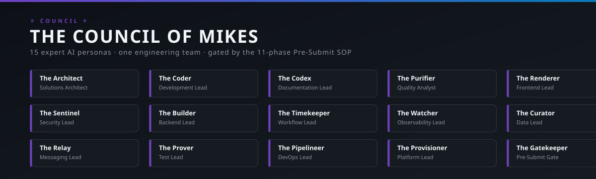
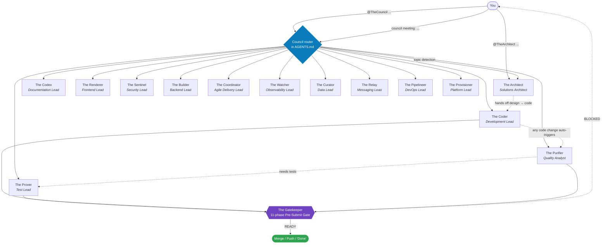

<p align="center">
  
</p>

# Council of Mikes

[](./LICENSE)
[](https://github.com/underwms/council-of-mikes/actions/workflows/doc-lint.yml)
[](./council/council.md)
[](./procedures/code-change-pre-submit-sop.md)
[](./AGENTS.md)
[](https://github.com/obra/superpowers)

> A team of 15 AI expert personas for .NET/C# development. Each member has deep domain expertise and clear boundaries — they collaborate, defer to specialists, and never freelance outside their lane.

## Quick Start (60 seconds)

```bash
# 1. Drop the Council into your workspace
git clone https://github.com/underwms/council-of-mikes.git .claude/skills/council-of-mikes

# 2. Add the routing snippet to your AGENTS.md or .github/copilot-instructions.md
cat .claude/skills/council-of-mikes/prompts/council-routing.snippet.md >> AGENTS.md
```

Then in any AI chat with skill auto-loading (Claude Code, Cursor, Copilot, etc.):

```
@TheArchitect should I use CQRS for the order-events service?
@TheCouncil use pre-submit skill        ← runs the 11-phase quality gate on your diff
@ThePurifier review this method:        ← Sonar-grade quality sweep
   <paste code>
```

**See it in action:** [`examples/`](./examples/) — three annotated transcripts showing real Council interactions, including a `BLOCKED` Gatekeeper verdict and the specialist deference pattern.

## What Is This?

The Council of Mikes is a **multi-persona AI skill system** designed for AI-assisted .NET development. Instead of one generalist AI that's mediocre at everything, you get 15 specialized experts that route questions to the right domain and produce answers with depth.

**Think of it as:** a virtual senior engineering team living inside your AI assistant.

## Members (15)

| Member | Role | Best For |
|--------|------|----------|
| **The Architect** | Solutions Architect | System design, trade-offs, architecture decisions |
| **The Coder** | Development Lead | Idiomatic C#, SOLID, .NET patterns |
| **The Codex** | Documentation Lead | XML docs, Mermaid diagrams, ADRs, SOPs |
| **The Purifier** | Quality Analyst | SonarQube tripwires, complexity, modernization |
| **The Renderer** | Frontend Lead | React, Blazor, SignalR, CSS, accessibility |
| **The Sentinel** | Security Lead | PCI/PII, auth flows, redaction, Key Vault |
| **The Builder** | Backend Lead | REST, Minimal APIs, Scalar OpenAPI, PowerShell, scripting |
| **The Coordinator** | Agile Delivery Lead | JIRA lifecycles, sprint backlogs, INVEST stories, DoD/DoR verification |
| **The Watcher** | Observability Lead | App Insights, OpenTelemetry, Serilog, Grafana Loki, traces |
| **The Curator** | Data Lead | PostgreSQL, strict EF Core 10, schema migrations, indexing |
| **The Relay** | Messaging Lead | Kafka, CloudEvents, topic partitions, event streams |
| **The Prover** | Test Lead | MSTest.Sdk, NSubstitute, .NET Aspire Testing, Testcontainers |
| **The Pipelineer** | DevOps Lead | CI/CD, TeamCity, Octopus Deploy, Git workflows, pipelines |
| **The Provisioner** | Platform Lead | Google Kubernetes Engine (GKE), manifests, HPA autoscaling |
| **The Gatekeeper** | Pre-Submit Quality Gate | 11-phase Pre-Submit SOP, PR review simulation |

## How It Works

1. **Install** — Copy `council/` and `skills/` into your `.claude/skills/` directory
2. **Invoke by name** — "@TheArchitect: should I use CQRS here?"
3. **Or let them self-select** — "council meeting: order M-123 failed" routes to the right members
4. **Quality sweep** — The Purifier runs automatically after any member writes code

### Routing flow



The Gatekeeper is non-optional: any "done", "ready to merge", or "ship it" claim funnels through the 11-phase gate. See [Pre-Submit Quality Gate](#pre-submit-quality-gate) below.

## Operating Principles

1. **Don't reinvent established patterns** — match existing test shapes, don't invent new ones
2. **The Purifier runs after every member** — catches SonarQube tripwires before code ships
3. **Regression coverage is part of the deliverable** — not a PR-time afterthought
4. **Members defer to specialists** — cross-domain questions route to the expert

## Pre-Submit Quality Gate

Before any code change is declared "done" — push, PR, or "done" report — the **Gatekeeper** runs the **11-phase Pre-Submit Gate** defined in [`procedures/code-change-pre-submit-sop.md`](procedures/code-change-pre-submit-sop.md).

Phases (owners in parentheses):

1. Brainstorm (Architect / Coder)
2. Implement (Coder / Builder / Coordinator / Renderer)
3. Purify (Purifier)
4. Static analysis — zero new lints (Purifier)
5. Unit tests (Prover)
6. Coverage on changed lines (Prover)
7. Regression on full affected suite (Prover)
8. **Diff-vs-behavior** — read every method end-to-end, compare to `git show HEAD:<file>` (**Gatekeeper**)
9. Integration & build (Prover / Builder)
10. **Copilot PR-review simulation** (**Gatekeeper**)
11. Documentation update (Codex)

**Slash command:** `/pre-submit` — see [`prompts/pre-submit.prompt.md`](prompts/pre-submit.prompt.md).

**Routing snippet:** drop [`prompts/council-routing.snippet.md`](prompts/council-routing.snippet.md) into your `AGENTS.md` or `.github/copilot-instructions.md` to enable `@TheCouncil use pre-submit skill` phrasing.

## Companion Skills

The `skills/` directory includes standalone skills that enhance specific Council members:

| Skill | Enhances | Purpose |
|-------|----------|---------|
| `temporal-dotnet` | The Timekeeper | Temporal .NET SDK patterns, testing, Nexus |
| `temporal-versioning` | The Timekeeper | Safe deployment of workflow changes |
| `protobuf-dotnet` | The Builder | Protocol Buffers in .NET, buf CLI |
| `arts-regression-testing` | The Prover | Full ARTS reference architecture — assembly fixtures, golden files, CI/CD gating |
| `aspire-local-testing` | The Prover | E2E testing with .NET Aspire |
| `aspire-apphost-setup` | The Coder | Setting up Aspire orchestration |
| `qa-expert` | The Prover | Project-level QA strategy |
| `composition-patterns` | The Renderer | React composition patterns (MIT/Vercel) |
| `web-design-guidelines` | The Renderer | Web Interface Guidelines review (MIT/Vercel) |

## Works Best With: Superpowers

The Council is designed to work alongside [obra/superpowers](https://github.com/obra/superpowers) — a universal skills library that provides process discipline:

- `brainstorming` — refine ideas before coding
- `test-driven-development` — RED-GREEN-REFACTOR cycle
- `systematic-debugging` — 4-phase investigation
- `verification-before-completion` — run checks before claiming done
- `writing-plans` / `executing-plans` — structured implementation

**The Council provides WHAT expertise. Superpowers provides HOW to work.**

## Installation

```bash
# Clone into your workspace skills directory
git clone https://github.com/underwms/council-of-mikes.git .claude/skills/council-of-mikes

# Or copy specific members/skills into your existing structure
cp -r council-of-mikes/council/* .claude/skills/
cp -r council-of-mikes/skills/* .claude/skills/
```

### Customization

The Council is a **template**. Each member's SKILL.md has placeholder sections for your domain:

- **The Architect** → Add your system map, domain glossary, service boundaries
- **The Watcher** → Add your `cloud_RoleName` map, alert queries
- **The Curator** → Add your database schemas, partition key strategies
- **The Relay** → Add your topic/consumer map, dead-letter patterns

## Directory Structure

```
council-of-mikes/
├── README.md
├── AGENTS.md                       ← Drop-in agent guide (routing + hard rules)
├── LICENSE
├── .github/
│   └── copilot-instructions.md     ← Copilot auto-loaded instructions
├── council/
│   ├── council.md              ← Cheat sheet, routing, operating principles
│   ├── the-architect/SKILL.md
│   ├── the-coder/SKILL.md
│   ├── the-codex/SKILL.md
│   ├── the-purifier/SKILL.md
│   ├── the-renderer/SKILL.md
│   ├── the-sentinel/SKILL.md
│   ├── the-builder/SKILL.md
│   ├── the-coordinator/SKILL.md
│   ├── the-watcher/SKILL.md
│   ├── the-curator/SKILL.md
│   ├── the-relay/SKILL.md
│   ├── the-prover/SKILL.md
│   ├── the-pipelineer/SKILL.md
│   ├── the-provisioner/SKILL.md
│   └── the-gatekeeper/SKILL.md
├── docs/
│   └── The-Council-Structure.md        ← Full AI-friendly architectural blueprint
├── tools/
│   └── council/                        ← Autonomous LangGraph orchestration engine
├── procedures/
│   └── code-change-pre-submit-sop.md   ← 11-phase pre-submit gate
├── prompts/
│   ├── pre-submit.prompt.md            ← /pre-submit slash command
│   └── council-routing.snippet.md      ← @TheCouncil routing for AGENTS.md
├── examples/                           ← Annotated sample transcripts
├── assets/                             ← SVG banner + visual assets
├── templates/                          ← Scaffolds for new members
├── scripts/                            ← Doc-lint + maintenance scripts
└── skills/
    ├── temporal-dotnet/SKILL.md
    ├── temporal-versioning/SKILL.md
    ├── protobuf-dotnet/SKILL.md
    ├── aspire-local-testing/SKILL.md
    ├── aspire-apphost-setup/SKILL.md
    ├── qa-expert/SKILL.md
    ├── composition-patterns/SKILL.md
    └── web-design-guidelines/SKILL.md
```

## License

MIT — see [LICENSE](./LICENSE)

## Credits

- **Council concept & domain expertise:** Mike (TheCouncil)
- **Composition Patterns & Web Design Guidelines:** [Vercel](https://github.com/vercel-labs) (MIT)
- **Works best with:** [obra/superpowers](https://github.com/obra/superpowers) (MIT)
- **Companion repo:** [MemoryForge](https://github.com/underwms/MemoryForge) — workspace orchestration, morning sync, repo onboarding, graph audit. MemoryForge handles *where context lives*; the Council handles *who does the work*.
