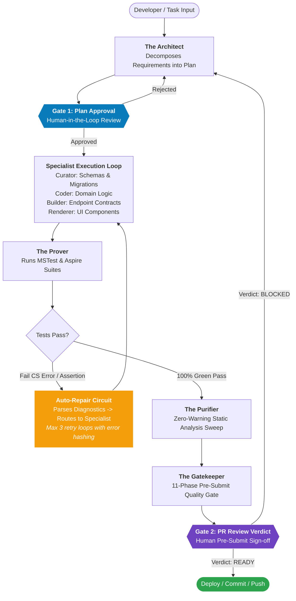

<p align="center">
  
</p>

# Council of Mikes (V2)

[](./LICENSE)
[](./CHANGELOG.md)
[](https://github.com/underwms/council-of-mikes/actions/workflows/doc-lint.yml)
[](./council/council.md)
[](./procedures/code-change-pre-submit-sop.md)
[](./tools/council/)
[](./AGENTS.md)

> **An autonomous multi-agent engineering team and persona framework for modern enterprise .NET / C# ecosystems.**  
> 15 specialized leads operate with deep domain doctrine, inviolable boundaries, and mutual deference—orchestrated by an autonomous LangGraph state engine and guarded by an uncompromising 11-phase pre-submit quality gate.

---

## ⚡ Quick Start (Two Ways to Run)

### Option A: The Autonomous Engine (CLI State Machine)
Run the Council as an autonomous orchestration engine that plans, writes, tests, and repairs code:

```bash
# 1. Install dependencies
cd tools/council
pip install -r requirements.txt

# 2. Convene the Council with a task
python scripts/convene.py "Implement price tier calculation pipeline with strict EF Core 10 and MSTest coverage"
```

### Option B: Interactive AI Assistant (Gemini CLI / Claude Code / Copilot)
One-click provision the Council into your local development environment:

```powershell
# Run the turnkey workstation provisioner
powershell -NoProfile -ExecutionPolicy Bypass -File .\scripts\setup-council.ps1
```

Then in any AI session:

```text
@the-architect evaluate whether we should use CQRS or standard queries here
@the-coder refactor the service to modern C# 13 primary constructors
@the-curator author the PostgreSQL schema migration and EF Core Fluent API mappings
@the-gatekeeper run the 11-phase pre-submit quality gate on my changes
```

---

## 🏛️ What Is This?

Generalist AI coding assistants are mediocre at complex enterprise architecture because they try to hold all disciplines in a single vanilla context window. 

**The Council of Mikes replaces generic AI with a virtual senior engineering pod.**  
Each member is an opinionated domain lead with deep doctrine, explicit decision guides (Records vs Classes, HTTP semantics, testing pyramid ratios), and hard boundaries:
- **They never freelance outside their lane.**
- **They defer cross-cutting questions to dedicated peers.**
- **They enforce empirical verification over assumptions.**

---

## 👥 The 15 Council Specialists

| Specialist & Role | Domain Focus | 2026 Enterprise Doctrine & Stack |
| :--- | :--- | :--- |
| [**The Architect**](./council/the-architect/SKILL.md)<br>Solutions Architect | System design, domain boundaries, CQRS, trade-off matrices | Clean/Onion Architecture, domain isolation, event streaming vs REST |
| [**The Builder**](./council/the-builder/SKILL.md)<br>Backend API Lead | High-throughput APIs, REST contracts, host automation | .NET 10 Minimal APIs, Scalar OpenAPI 3.0, typed results, PowerShell |
| [**The Coder**](./council/the-coder/SKILL.md)<br>C# Development Lead | Modern language features, SOLID design, async purity | C# 10–14, primary constructors, collection expressions, pattern matching |
| [**The Codex**](./council/the-codex/SKILL.md)<br>Documentation Lead | Living architecture wikis, ADRs, Mermaid diagrams | Centralized docs hierarchy, XML code comments, semantic markdown |
| [**The Coordinator**](./council/the-coordinator/SKILL.md)<br>Agile Delivery Lead | JIRA issue lifecycles, sprint backlogs, INVEST stories | INVEST criteria, Gherkin acceptance tests, Definition of Ready/Done |
| [**The Curator**](./council/the-curator/SKILL.md)<br>Database & Persistence Lead | PostgreSQL relational schemas, migrations, index tuning | Strict EF Core 10, lower_snake_case, zero Dapper, zero Redis |
| [**The Gatekeeper**](./council/the-gatekeeper/SKILL.md)<br>Pre-Submit Quality Gate | Pre-submit SOP audit, PR review simulation, verification | 11-Phase Quality Gate SOP, diff-vs-behavior semantic analysis |
| [**The Pipelineer**](./council/the-pipelineer/SKILL.md)<br>DevOps Lead | CI/CD automation, build pipelines, promotion gates | TeamCity, Octopus Deploy, multi-repo Git branching strategies |
| [**The Prover**](./council/the-prover/SKILL.md)<br>Testing & Validation Lead | Unit testing, integration suites, hermetic proofs | MSTest.Sdk, NSubstitute, .NET Aspire Testing, real PostgreSQL containers |
| [**The Provisioner**](./council/the-provisioner/SKILL.md)<br>Platform Hosting Lead | Cloud topology, container runtime sizing, autoscaling | Google Kubernetes Engine (GKE), K8s manifests, HPA, non-root security |
| [**The Purifier**](./council/the-purifier/SKILL.md)<br>Quality & Static Analysis Lead | Roslyn analysis, zero-warning sweeps, dead code pruning | `<TreatWarningsAsErrors>true</TreatWarningsAsErrors>`, SonarQube, Deno lint |
| [**The Relay**](./council/the-relay/SKILL.md)<br>Distributed Messaging Lead | Event-driven streaming, topic partitioning, message contracts | Apache Kafka, CloudEvents 1.0, consumer groups, Dead-Letter Queues |
| [**The Renderer**](./council/the-renderer/SKILL.md)<br>Frontend UI Lead | Pixel-perfect layouts, responsive design, component state | React Router 7, Vite, Deno runtime, TypeScript strict typing, CSS modules |
| [**The Sentinel**](./council/the-sentinel/SKILL.md)<br>Security & Auth Lead | Token authentication, authorization scopes, secret hygiene | Okta preview OIDC, dynamic `IAuthorizationPolicyProvider`, PII sanitization |
| [**The Watcher**](./council/the-watcher/SKILL.md)<br>Observability Lead | Live diagnostics, distributed tracing, structured logging | OpenTelemetry SDK, W3C `traceparent`, Serilog `LoggerMessage`, Grafana Loki |

---

## 🔄 Autonomous Orchestration & Routing Flow

When you convene the Council via `convene.py` or the LangGraph engine, tasks flow through an autonomous state machine with human-in-the-loop oversight and automated error-recovery loops:



---

## 🛡️ The 11-Phase Pre-Submit Quality Gate

The **Gatekeeper** enforces the **11-phase Pre-Submit Gate** defined in [`procedures/code-change-pre-submit-sop.md`](procedures/code-change-pre-submit-sop.md). No work is declared "done" and no code is merged without passing:

1. **Phase 1 — Brainstorm**: Smallest unit of change defined; unknowns surfaced.
2. **Phase 2 — Implement**: Full methods read end-to-end; surgical edits applied.
3. **Phase 3 — Purify**: Five-pass cleaner sweep (formatting, modernization, dead code).
4. **Phase 4 — Static Analysis**: `<TreatWarningsAsErrors>true</TreatWarningsAsErrors>`; zero new diagnostics.
5. **Phase 5 — Unit Tests**: MSTest.Sdk + NSubstitute; AAA pattern; boundary cases verified.
6. **Phase 6 — Coverage**: ≥ 80% coverage on changed lines with meaningful assertions.
7. **Phase 7 — Regression**: Full test suite green across all consumers; zero skipped tests.
8. **Phase 8 — Diff-vs-Behavior**: Semantic reading of every changed method against prior behavior.
9. **Phase 9 — Integration & Build**: Real containerized Aspire test runs; clean multi-stage build.
10. **Phase 10 — Copilot PR-Review Simulation**: Hostile automated reviewer simulation.
11. **Phase 11 — Documentation Update**: Living docs, XML summaries, and ADRs synchronized.

---

## 🛠️ The 9 Workflow Superpowers

The Council packages 9 formal operational skills under `skills/` providing process discipline for complex tasks:

- **`brainstorming`** — Collaborative design and specification formulation prior to code modification.
- **`writing-plans`** — Bite-sized, test-driven implementation plan decomposition.
- **`test-driven-development`** — Mandatory Red-Green-Refactor development discipline.
- **`systematic-debugging`** — 4-phase root cause investigation for bugs and test regressions.
- **`verification-before-completion`** — Mandatory empirical evidence gathering before claiming completion.
- **`handoff`** — Incremental session persistence protocol (`active_handoff.md`).
- **`repo-documentation`** — Maintaining repository architecture wikis and living documentation.
- **`the-council-orchestration`** — LangGraph state graph coordination and specialist delegation.
- **`using-superpowers`** — Meta-skill governing skill discovery and tool invocation discipline.

---

## 📂 Repository Directory Layout

```text
council-of-mikes/
├── README.md                           ← Master overview, quick start, and specialist roster
├── AGENTS.md                           ← Universal agent execution instructions
├── CHANGELOG.md                        ← Semantic versioning release chronology
├── LICENSE                             ← MIT License
├── council/
│   ├── council.md                      ← Council operating principles, routing tables, and prompts
│   ├── the-architect/SKILL.md          ← Solutions Architecture Lead (Onion Architecture, CQRS)
│   ├── the-builder/SKILL.md            ← Backend API Lead (Minimal APIs, Scalar, REST semantics)
│   ├── the-coder/SKILL.md              ← C# Development Lead (Idiomatic C# 13, SOLID, async purity)
│   ├── the-codex/SKILL.md              ← Documentation Lead (Wikis, ADRs, Mermaid diagrams)
│   ├── the-coordinator/SKILL.md        ← Agile Delivery Lead (JIRA, sprint backlogs, INVEST stories)
│   ├── the-curator/SKILL.md            ← Database Lead (PostgreSQL, strict EF Core 10, migrations)
│   ├── the-gatekeeper/SKILL.md         ← Pre-Submit Quality Gate (11-Phase SOP, PR simulation)
│   ├── the-pipelineer/SKILL.md         ← DevOps Lead (TeamCity, Octopus Deploy, Git branching)
│   ├── the-prover/SKILL.md             ← Testing Lead (MSTest.Sdk, NSubstitute, Aspire testing)
│   ├── the-provisioner/SKILL.md        ← Platform Lead (GKE, Kubernetes manifests, HPA)
│   ├── the-purifier/SKILL.md           ← Code Quality Lead (Roslyn static analysis, zero warnings)
│   ├── the-relay/SKILL.md              ← Messaging Lead (Apache Kafka, CloudEvents, partitions)
│   ├── the-renderer/SKILL.md           ← Frontend Lead (React Router 7, Vite, Deno, Kiwi CSS)
│   ├── the-sentinel/SKILL.md           ← Security Lead (Okta preview OIDC, dynamic policies)
│   └── the-watcher/SKILL.md            ← Observability Lead (OpenTelemetry, Serilog, Grafana Loki)
├── docs/
│   └── The-Council-Structure.md        ← Canonical AI-friendly architectural blueprint
├── tools/
│   └── council/                        ← Autonomous LangGraph orchestration engine & 11 test suites
├── procedures/
│   └── code-change-pre-submit-sop.md   ← The 11-phase Pre-Submit Quality Gate SOP
├── scripts/
│   ├── setup-council.ps1               ← One-click developer workstation provisioner
│   ├── convene.py                      ← Universal CLI runner for convening the Council
│   ├── onboard.py                      ← Automatic session onboarding & rolling backlog rotation
│   ├── heartbeat_hook.py               ← Deterministic AfterAgent lifecycle hook
│   ├── validate_workspace.py           ← Universal 5-phase cross-platform Python integrity validator
│   └── validate-council.ps1            ← CI doc-lint validator (all 8 checks)
└── skills/                             ← Workflow superpowers & companion skill packages
```

---

## 📜 License & Acknowledgments

- **License:** MIT — see [LICENSE](./LICENSE).
- **Creator & Lead Architect:** Mike Underwood ([@underwms](https://github.com/underwms))
- **Companion Infrastructure:** [MemoryForge](https://github.com/underwms/MemoryForge) — Ephemeral session cache, automated morning sync, and graph integrity auditing.
